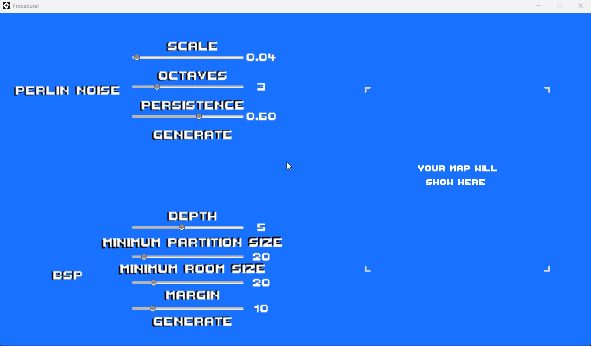

# Geração Procedural - Perlin Noise & Binary Space Partitioning (BSP)

Este projeto foi desenvolvido no **GameMaker Studio 2** com o objetivo de demonstrar de forma interativa como funcionam dois dos algoritmos mais utilizados para geração procedural de mapas em jogos: **Perlin Noise** e **Binary Space Partitioning (BSP)**.

Através de uma **interface intuitiva com sliders**, o usuário pode alterar os principais parâmetros de cada algoritmo e visualizar em tempo real como esses valores afetam a geração dos mapas.

## Funcionalidades

- **Perlin Noise 2D**: Geração de mapas baseada em ruído contínuo com suporte a múltiplas oitavas, persistência, escala, entre outros parâmetros.
- **Binary Space Partitioning (BSP)**: Geração de dungeons estruturadas por divisão recursiva e conexão de salas com corredores.
- Interface interativa: ajuste de parâmetros em tempo real via sliders.
- Visualização gráfica dos mapas gerados em tempo real.

## Tecnologias Utilizadas

- **GameMaker Studio 2**
- **GML (GameMaker Language)**

## Como Usar

Você pode utilizar este projeto de duas formas:

### 1. Executando o projeto diretamente

1.1. Clone o repositório:
```bash
   git clone https://github.com/vinicius-dantasso/procedural-generation.git
```

1.2. Acesse a pasta procedural-generation; <br>
1.3. Extraia o arquivo Procedural.zip; <br>
1.4. Execute o arquivo .exe contido na pasta extraída.

### 2. Abrindo o projeto no GameMaker Studio 2

2.1. Clone o repositório:
```bash
   git clone https://github.com/vinicius-dantasso/procedural-generation.git
```
2.2. No GameMaker Studio 2, clique em "Importar Projeto"; <br>
2.3. Selecione a pasta clonada do projeto; <br>
2.4. Explore, edite e teste os algoritmos diretamente no ambiente do GMS2.

## Interface do Projeto



## Objetivos Didáticos

Este projeto foi idealizado com fins educacionais, especialmente para estudantes e desenvolvedores interessados em entender como algoritmos de geração procedural funcionam em jogos. É uma ótima base para:

- Experimentar efeitos de parâmetros sobre mapas.
- Integrar geração procedural em jogos 2D.
- Comparar resultados visuais entre dois tipos diferentes de algoritmo.
